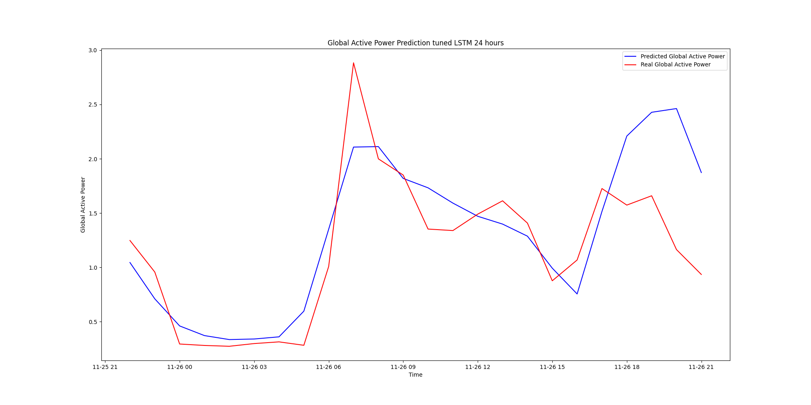

# Predicting energy consumption in households using time series

This project, aims to predict energy consumption in households using time series analysis. By analyzing historical data,
we can develop models that forecast future energy usage, enabling better resource management and energy efficiency.
Models that were tested in project include:

- Naive Seasonal
- XGBoost
- LSTM
- Tuned LSTM
- Complex and Tuned LSTM

## Installation

The project uses Poetry to manage dependencies. To install the dependencies, run the following command:

```bash
poetry install
```

## Data

For the analysis, the "**Household Electric Power Consumption**" dataset available on
_Kaggle_ was used. It consists of approximately 2 million records representing energy consumption for a
selected household over the period December 2006 - November 2010 (47 months).
The dataset needs to be preprocessed before it can be used for training the models. The preprocessing steps include:

- Conversion of the 'Date' and 'Time' columns to a single 'Datetime' column
- Checking and removing missing values (? then NaN)
- Forward filling missing values
- Resampling the data to hourly frequency
- Normalizing the data using MinMaxScaler
- Splitting the data into training and testing sets
- Creating sequences of data for the LSTM models

## Training and hyperparameter tuning

The models were trained using the training data and evaluated using the testing data. LSTM model was tuned using the
Optuna library to find the best hyperparameters. The best hyperparameters were then used to train the final model and
perform predictions.

## Results

The results of the models were evaluated using several metrics:

- Mean Absolute Error (MAE)
- Mean Squared Error (MSE)
- Root Mean Squared Error (RMSE)
- Mean Absolute Percentage Error (MAPE)

## Prediction examples

The following plots show the predictions made by the models for the testing data:

- XGBoost


- LSTM


- Tuned LSTM



- Complex and Tuned LSTM

